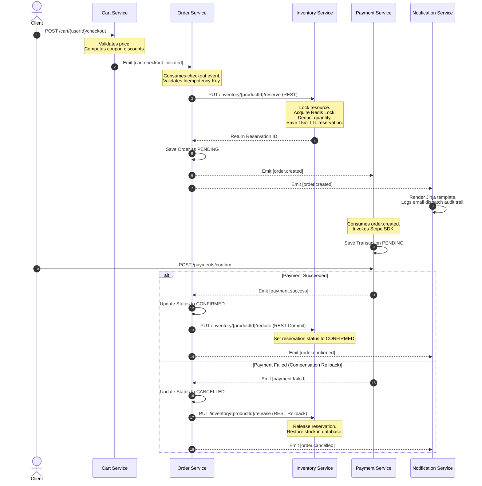

# ShopNow - Production-Grade E-Commerce Platform

ShopNow is a highly scalable, event-driven E-Commerce platform built using a 10-Microservice Architecture following Domain-Driven Design (DDD) principles.

## System Architecture

```
                                  [ CLIENT LAYER ]
                      (Web App, Mobile App, Admin Dashboard)
                                         |
                                         v
                            [ NGINX API GATEWAY (Port 80) ]
                                         |
    +------------------+-----------------+------------------+-----------------+
    | (REST)           | (REST)          | (REST)           | (REST)          | (REST)
    v                  v                 v                  v                 v
[User Service]   [Product Svc]     [Cart Service]     [Order Service]   [Review Service]
 (Port 8081)      (Port 8082)       (Port 8086)        (Port 8083)       (Port 8089)
    |                  |                 |                  |                 |
    +---- PostgreSQL   +---- MongoDB     +---- Redis        +---- PostgreSQL  +---- MongoDB
    |                  |                 |                  |
    | (REST)           |                 | (REST)           | (REST)
    v                  v                 v                  v
[Search Service]   [Payment Svc]     [Inventory Svc]   [Notification]    [Analytics]
 (Port 8088)      (Port 8084)       (Port 8085)        (Port 8087)       (Port 8090)
    |                  |                 |                  |                 |
    +---- ES           +---- PostgreSQL  +---- PostgreSQL   +---- PostgreSQL  +---- ClickHouse
                                         +---- Redis (Lock) +---- Redis       
                                         
    +-------------------------------------------------------------------------+
    |                             APACHE KAFKA (EVENT BUS)                    |
    +-------------------------------------------------------------------------+
```

---

## Repository Structure

- [services/](file:///c:/Users/prasadmummadisetti/Desktop/devopsproject/services/)
  - [user-service/](file:///c:/Users/prasadmummadisetti/Desktop/devopsproject/services/user-service/) - Spring Boot (PostgreSQL + Redis session store)
  - [product-service/](file:///c:/Users/prasadmummadisetti/Desktop/devopsproject/services/product-service/) - Node.js Express (MongoDB + Redis cache + S3 pre-signed uploads)
  - [order-service/](file:///c:/Users/prasadmummadisetti/Desktop/devopsproject/services/order-service/) - Spring Boot (PostgreSQL + Kafka Saga listener/publisher)
  - [payment-service/](file:///c:/Users/prasadmummadisetti/Desktop/devopsproject/services/payment-service/) - Node.js (PostgreSQL + Stripe sandbox client)
  - [inventory-service/](file:///c:/Users/prasadmummadisetti/Desktop/devopsproject/services/inventory-service/) - Spring Boot (PostgreSQL + Redis locks)
  - [cart-service/](file:///c:/Users/prasadmummadisetti/Desktop/devopsproject/services/cart-service/) - Node.js (Redis storage + checkout events)
  - [notification-service/](file:///c:/Users/prasadmummadisetti/Desktop/devopsproject/services/notification-service/) - Python FastAPI (PostgreSQL + Jinja2 + Twilio/SendGrid mock)
  - [search-service/](file:///c:/Users/prasadmummadisetti/Desktop/devopsproject/services/search-service/) - Python FastAPI (Elasticsearch product indexing)
  - [review-service/](file:///c:/Users/prasadmummadisetti/Desktop/devopsproject/services/review-service/) - Spring Boot (MongoDB + verified purchases)
  - [analytics-service/](file:///c:/Users/prasadmummadisetti/Desktop/devopsproject/services/analytics-service/) - Python (Ingests all events to ClickHouse/SQLite)
- [infrastructure/](file:///c:/Users/prasadmummadisetti/Desktop/devopsproject/infrastructure/)
  - [docker-compose.yml](file:///c:/Users/prasadmummadisetti/Desktop/devopsproject/infrastructure/docker-compose.yml) - Local infrastructure services
  - [k8s/](file:///c:/Users/prasadmummadisetti/Desktop/devopsproject/infrastructure/k8s/) - Kubernetes deployment and routing manifests per service
- [api-gateway/](file:///c:/Users/prasadmummadisetti/Desktop/devopsproject/api-gateway/)
  - [nginx.conf](file:///c:/Users/prasadmummadisetti/Desktop/devopsproject/api-gateway/nginx.conf) - Reverse proxy routing definitions
- [docs/](file:///c:/Users/prasadmummadisetti/Desktop/devopsproject/docs/)
  - [architecture/](file:///c:/Users/prasadmummadisetti/Desktop/devopsproject/docs/architecture/) - Diagrams and schemas

---

## Saga Choreography Transaction Workflow

We implement **Choreography-based Saga** to manage distributed transactions across Order, Inventory, Payment, and Notification services:



---

## Gateway Routing Table

Public endpoints route through port `80` mapping path prefixes:

| Path Prefix | Target Service | Core Port | Database |
| :--- | :--- | :--- | :--- |
| `/auth/` | User & Auth | `8081` | PostgreSQL (`shopnow_user`) |
| `/users/` | User & Auth | `8081` | PostgreSQL (`shopnow_user`) |
| `/products/` | Product Catalogue| `8082` | MongoDB (`shopnow_product`) |
| `/orders/` | Order Management | `8083` | PostgreSQL (`shopnow_order`) |
| `/payments/` | Payment Service | `8084` | PostgreSQL (`shopnow_payment`) |
| `/inventory/` | Inventory Service| `8085` | PostgreSQL (`shopnow_inventory`)|
| `/cart/` | Shopping Cart | `8086` | Redis (DB index 3) |
| `/notifications/`| Notification Svc | `8087` | PostgreSQL (`shopnow_notification`)|
| `/search/` | Search Service | `8088` | Elasticsearch |
| `/reviews/` | Review & Rating | `8089` | MongoDB (`shopnow_review`) |
| `/analytics/` | Analytics Svc | `8090` | ClickHouse / SQLite |

---

## Local Development Execution

1. Start database, queue, cache and storage services:
   ```bash
   cd infrastructure
   docker-compose up -d
   ```
2. Runtimes setup:
   - Run Java services (`mvn spring-boot:run` in respective folders).
   - Run Node services (`npm install` then `npm start` in folders).
   - Run Python services (`pip install -r requirements.txt` then `uvicorn src.main:app` in folders).
