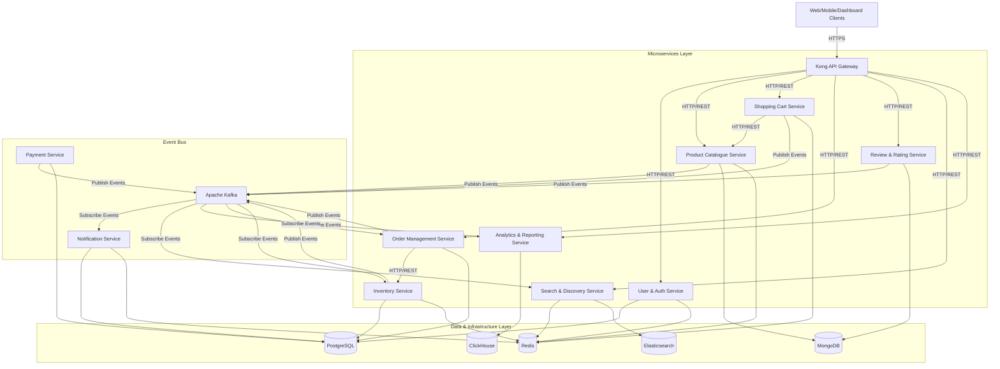

# ShopNow Architecture Documentation

This directory contains the architecture documentation and designs for the ShopNow E-Commerce platform.

## High-Level System Architecture

## Data Persistence & Technology Choices

| Service | Language/Framework | Database | Message Broker | Cache / Lock Store |
| :--- | :--- | :--- | :--- | :--- |
| **User Service** | Java Spring Boot | PostgreSQL | - | Redis (Token list / TTL) |
| **Product Catalogue** | Node.js Express | MongoDB | Kafka (Producer) | Redis (Page Cache) |
| **Order Management** | Java Spring Boot | PostgreSQL | Kafka (Prod & Cons) | - |
| **Payment Service** | Node.js Express | PostgreSQL | Kafka (Producer) | - |
| **Inventory Service**| Java Spring Boot | PostgreSQL | Kafka (Prod & Cons) | Redis (Redlock, TTL) |
| **Shopping Cart** | Node.js Express | - | Kafka (Producer) | Redis (Cart Storage) |
| **Notification** | Python FastAPI | PostgreSQL | Kafka (Consumer) | Redis |
| **Search Service** | Python FastAPI | Elasticsearch | Kafka (Consumer) | Redis (Query Cache) |
| **Review Service** | Java Spring Boot | MongoDB | Kafka (Producer) | - |
| **Analytics Service**| Python | ClickHouse / SQLite| Kafka (Consumer) | - |
